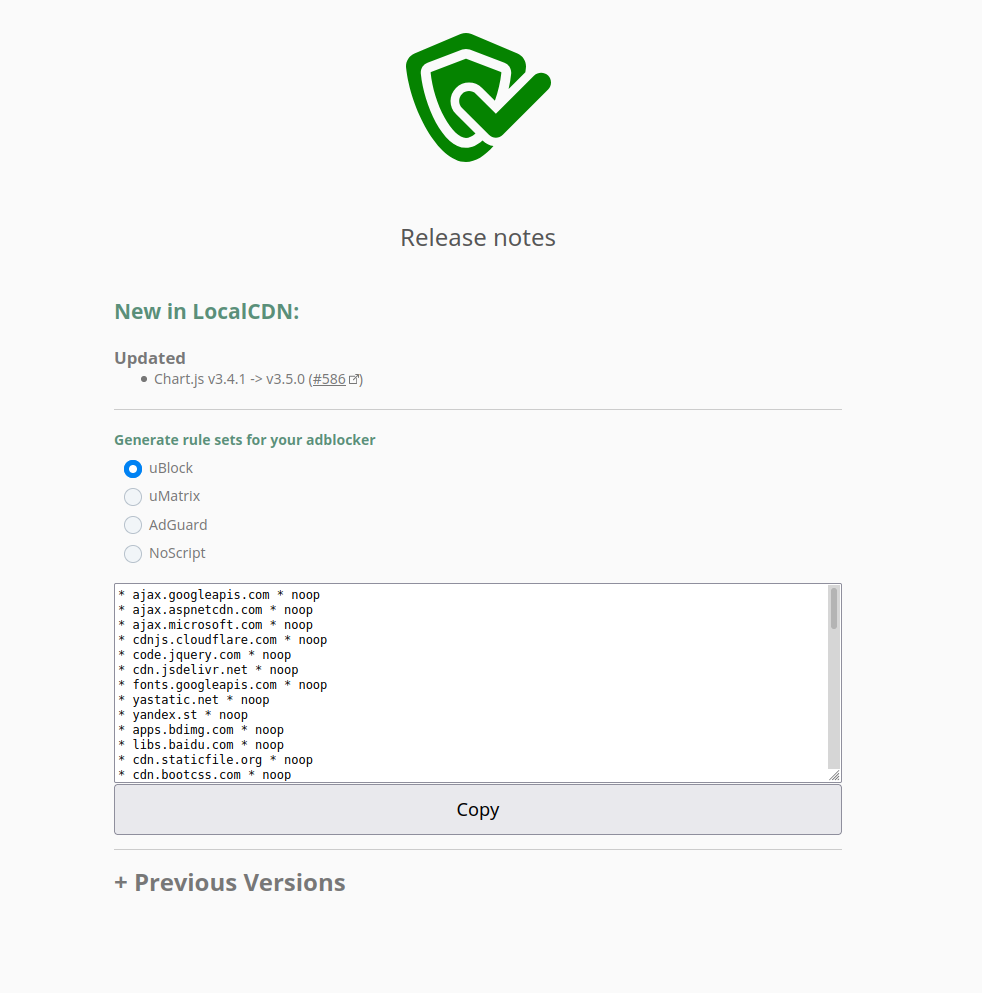

# LocalCDN
A web browser extension (and a fork of Decentraleyes) that emulates Content Delivery Networks to improve your online privacy. It intercepts traffic, finds supported resources locally, and injects them into the environment. All of this happens automatically, so no prior configuration is required. Feel free to use the following [testing utility](https://localcdn.de/test/) to find out if you are properly protected. For more information, please read this [basic introduction from Decentraleyes](https://git.synz.io/Synzvato/decentraleyes/wikis/Simple-Introduction) or our [Wiki pages](https://codeberg.org/nobody/LocalCDN/wiki). You can also [download](https://addons.mozilla.org/en-US/firefox/addon/localcdn-fork-of-decentraleyes/) the extension directly from Mozilla and just try it.

## Differences between LocalCDN and Decentraleyes

LocalCDN based on Decentraleyes. It includes more frameworks and more CDNs:

* **NEW: Removed integrity checks of embedded script and style elements (Firefox only)** :tada: :tada: :tada:
* Font Awesome
* jQuery up to 3.4.1
* Bootstrap CSS (Delivered by StackPath, NetDNA and MaxCDN)
* Bootstrap JavaScript (Delivered by StackPath, NetDNA and MaxCDN)
* AngularJS, AngularJS-Animate, AngularJS-Sanitize, AngularJS-Cookies and AngularJS-Touch
* Prepared rules for uBlock/uMatrix

> **Note:** LocalCDN is no silver bullet, but it does prevent a lot of websites from making you send these kinds of requests. Ultimately, you can make LocalCDN block requests for any missing CDN resources, too.

## What is the different of LocalCDN in comparison to other CDN emulators?

**Advantages of LocalCDN:**

:thumbsup: more frameworks/libraries

:thumbsup: smaller size than other extensions

:thumbsup: remove crossorigin and integrity attributes of script and stylesheet tags to increase replacements (Firefox only)

:thumbsup: doesn't matter which version a website requested

## We need you!

The whole Internet is full of different frameworks and CDNs that negatively affect your privacy. If you find a website that embeds another unsupported version of a framework, please report that website.

### :warning: **Important** :warning:

In some cases, it isn't possible to use our framework because the website sets up a strong "Same Origin Policy" (SOP). Please read [Broken JavaScript or CSS on some websites](https://codeberg.org/nobody/LocalCDN/wiki/Broken-JavaScript-or-CSS-on-some-websites) before opening an issue.

On behalf of everyone: Thank you!

## Screenshots

### Light

### Dark

### Rule generator for uBlock/uMatrix (after an update)

### Rule generator for uBlock/uMatrix (settings page)

## Contributing Code

Suggestions in the form of **Issues**, and contributions in the form of **Merge Requests**, are highly welcome.

## Installation

* Mozilla Firefox *(63 or higher)*: [get it on addons.mozilla.org](https://addons.mozilla.org/en-US/firefox/addon/localcdn-fork-of-decentraleyes/)
* Chromium based browser: [Chrome Web Store (by Emanuel Bennici)](https://chrome.google.com/webstore/detail/localcdn-fork-from-decent/njdfdhgcmkocbgbhcioffdbicglldapd) :warning: **Please note this Wiki article [FAQ: Chromium incompatibilities](https://codeberg.org/nobody/LocalCDN/wiki/Chromium-incompatibilities)** :warning:

#### Running the Code as temporary extension

Please read this [developer guide](https://developer.mozilla.org/en-US/Add-ons/WebExtensions/Your_first_WebExtension#Trying_it_out) for information on how to run the extension from source.

> **Important:** All tagged commits are signed with GPG. It's likely best to ignore unsigned commits, unless you really know what you're doing. Please send an email if you have any questions or security concerns.

## Contact

Just open an issue with your question or write an [email](https://localcdn.de/contact/) (PGP possible!).

## Donations

LocalCDN is free and open-source. If you like LocalCDN you can support continued development by making a donation. Any help would be greatly appreciated! Every way to donate can be found inside the extension (Just click on the heart). At the moment donations are possible with SEPA bank transfer, Bitcoin and Ether.

## License

[MPL-2.0](https://www.mozilla.org/MPL/2.0).
